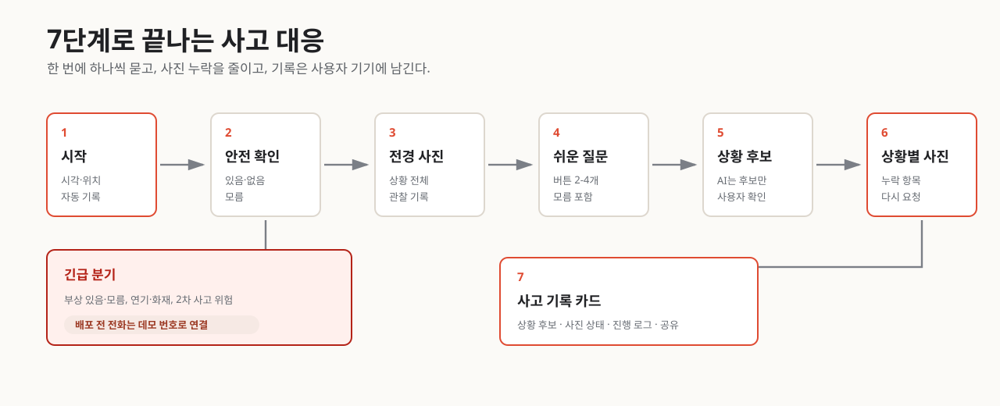

# 당황Zero MVP Scope

## 한 줄 목표

교통사고 직후 사용자가 글로 상황을 설명하지 않아도, 앱이 버튼형 질문과 사진 안내를 한 단계씩 제시해 안전 확인, 증거 기록, 다음 행동을 빠뜨리지 않게 돕는다.

## Primary User

사고 직후 당황해서 신고, 촬영, 차량 이동, 보험사 연락 순서를 판단하기 어려운 운전자

## 사용자 Pain Point

- 사고 직후에는 무엇부터 해야 할지 정하기 어렵다.
- 파손 부위만 찍고 전경, 번호판, 표지판, 위치 같은 관찰 기록을 놓칠 수 있다.
- 일반 챗봇은 사용자가 상황을 길게 설명해야 해서 현장에서 쓰기 어렵다.
- 서버나 외부 서비스에 사고 기록과 사진이 남는 것에 부담이 있다.

## MVP 핵심 가치

사용자가 사고 유형을 먼저 고르지 않아도, 앱이 한 번에 하나씩 묻고 필요한 사진을 다시 요청하며, 기록을 사용자 기기에 정리한다.

## Must Have

1. 사고 대응 시작
   - 시작 버튼 한 번으로 사고 시각과 위치를 기록한다.
   - 위치 권한이 없으면 수동 위치 메모를 받는다.

2. 안전 확인과 긴급 화면
   - 부상, 연기/화재, 사람/이륜차, 2차 사고 위험을 먼저 묻는다.
   - 긴급 후보일 때 전화 버튼을 보여주되 자동 신고하지 않는다.
   - 정식 배포 전에는 실제 112/119가 아니라 데모 번호로만 연결한다.

3. 버튼형 상황 파악
   - 질문 하나에 버튼 2-4개와 `모름`을 제공한다.
   - AI가 미리 채운 후보가 있더라도 사용자가 1탭으로 확인하거나 수정한다.

4. 상황별 사진 기록 안내
   - 전경, 번호판, 파손 부위, 시설물, 표지판/신호등 등 필요한 사진을 한 번에 하나씩 요청한다.
   - 누락 항목이 있으면 다음 사진 요청으로 되돌린다.

5. 사고 기록 카드와 히스토리
   - 사고 시간, 위치, 상황 후보, 사진 항목 상태, 체크리스트 상태를 로컬에 저장한다.
   - 히스토리에서 이전 기록을 다시 볼 수 있다.

## Should Have

1. 10초 무응답 시 음성 읽기 또는 화면 강조
2. 사진 품질 검사, 흔들림/어두움
3. 비전 API replay
4. 데모 데이터 초기화
5. share_plus 기반 기록 공유

## Could Have

1. Google Cloud Vision 기반 PhotoFacts 생성
2. 보조 모델 기반 PhotoFacts 보완
3. LLM 기반 사고 기록 문장 정리
4. PDF 내보내기
5. 앱 설정 백업/복원

## Won't Have for MVP

1. 과실비율 판단
2. 법적 책임 판단
3. 신고 필요 여부 확정
4. 112/119 신고 대체
5. 보험사 공식 판단 또는 실시간 접수
6. 경찰/소방 시스템 연동
7. 파손 부위 자체 학습 모델
8. 실제 번호판 OCR 확정 저장
9. 서버 장기 사진 저장

## 데모 성공 기준

- 사고 대응 시작부터 사고 기록 카드까지 3분 이내 완료한다.
- 핵심 데모 시나리오가 동일 환경에서 3회 연속 성공한다.
- mock/replay만으로 네트워크 없이 핵심 흐름을 설명할 수 있다.
- 데모 데이터에 실제 개인정보가 0개다.
- AI/CV 기능을 꺼도 기본 흐름이 동작한다.
- 앱은 과실, 법적 책임, 신고 필요 여부를 확정하지 않는다.
- 정식 배포 전 전화 버튼은 실제 긴급번호가 아니라 데모 번호로 연결된다.
