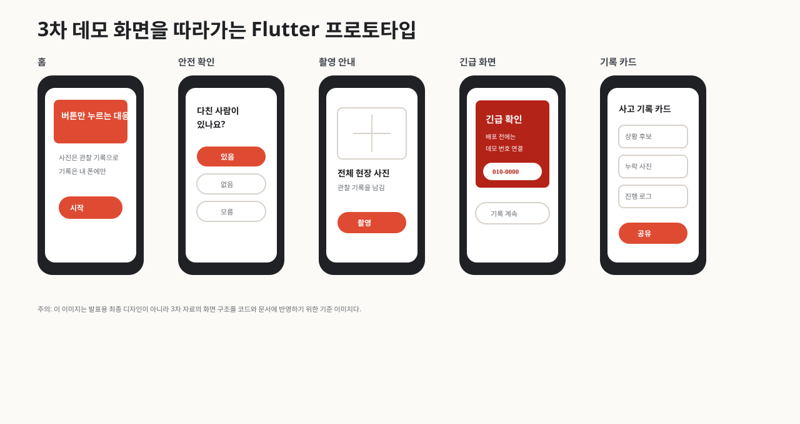
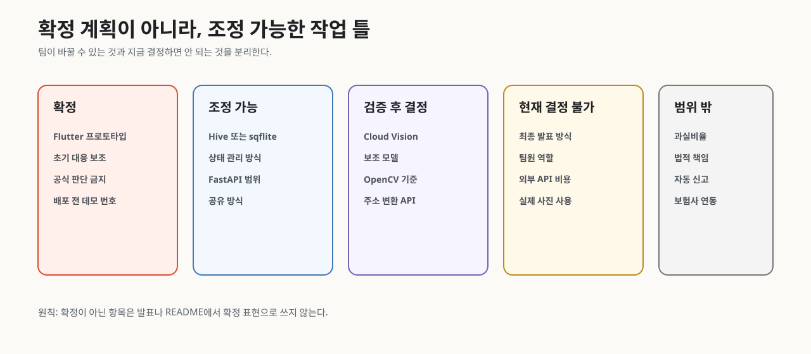

# 당황Zero 구현 전 산출물

이 폴더는 구현 전에 팀이 합의해야 하는 산출물을 나눠 정리한 것이다.

## 빠른 시각 요약

## 기준 자료

최신 기준은 `3조3차.pdf`이다. `3조 1차.pdf`, `3조2차.pdf`, `당황Zero_설계제안.html`은 배경 자료와 보강 근거로만 사용한다.

3차 기준으로 만든 현재 작업 틀:

- 확정: 사고 판단 앱이 아니라 사고 직후 초기 대응 보조 앱으로 둔다.
- 확정: 프론트 프로토타입은 Flutter 앱으로 만든다.
- 확정: 과실, 법적 책임, 신고 필요 여부는 앱이 확정하지 않는다.
- 조정 가능: 로컬 저장 구현은 현재 Hive를 기본안으로 두지만 sqflite 등으로 바꿀 수 있다.
- 조정 가능: FastAPI, Cloud Vision, 보조 모델, OpenCV는 검증 후 축소하거나 제외할 수 있다.
- 현재 결정 불가: 공식 체크리스트 문구, 외부 API 사용 여부, 최종 시연 방식은 팀/평가 기준/실험 결과가 필요하다.

## 파일 목록

- `00_project_overlay.md`: 프로젝트별 하네스 오버레이
- `01_mvp_scope.md`: MVP 범위와 제외 기능
- `02_feature_list.md`: 기능 목록과 담당 파트
- `03_screen_spec.md`: 화면별 구성과 기능
- `04_feature_scenarios.md`: 기능별 정상/실패 시나리오
- `05_api_spec.md`: API 계약 초안
- `06_erd_data_dictionary.md`: ERD와 데이터 사전
- `07_architecture_sequence.md`: 시스템 아키텍처와 핵심 시퀀스
- `08_demo_test_plan.md`: 데모와 테스트 계획 초안
- `09_research_decisions_missing_info.md`: 자료조사, 결정 근거, 부족 정보
- `10_team_collaboration_ownership.md`: 4인 팀 작업 소유권과 변경 권한
- `11_data_contracts_mock_replay.md`: PhotoFacts, NextAction, mock, replay, 시나리오 검증 계약
- `12_implementation_roadmap.md`: M0-M4 구현 로드맵과 품질 게이트
- `13_prototype_visual_reference.md`: 3차 데모 화면 기준과 Flutter 반영 상태
- `14_decision_status_register.md`: 확정/조정 가능/미결정/결정 불가 항목 정리

## 이미지 자료

- `images/01_user_flow.svg`: 7단계 사용자 흐름과 긴급 분기
- `images/02_prototype_screens.svg`: 3차 화면 방향 기반 프로토타입 화면
- `images/03_architecture.svg`: Flutter 중심 시스템 구조
- `images/04_decision_status.svg`: 확정/조정 가능/검증 후 결정/결정 불가/범위 밖 상태
- `images/05_emergency_call_guard.svg`: 배포 전 긴급 전화 데모 번호 안전장치

## 구현 시작 전 Gate

구현 시작 전 아래를 확인한다.

- MVP must-have 기능이 5개 이하로 정리되었고 팀 검토 대상이 표시되어 있다.
- 화면별 목적, 입력, API, 실패 상태가 작성되었다.
- must-have 기능별 정상/실패 시나리오가 있다.
- ERD와 데이터 사전 초안이 있다.
- 핵심 시퀀스와 fallback 흐름이 있다.
- 데모 시나리오와 테스트 시나리오가 있다.
- 주요 결정의 출처, 가정, 부족 정보가 정리되어 있다.
- 팀 작업 소유권과 shared contract 변경 기준이 정리되어 있다.
- PhotoFacts와 NextAction 계약이 정리되어 있다.
- mock 또는 replay로 AI/CV 없이 핵심 흐름을 검증할 수 있다.
- 로컬 저장 원칙과 외부 API 전송 금지 데이터가 정리되어 있다.
